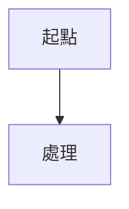

# 第 XX 章 - 章節名稱

## 標籤

- #cpts
- #chapter

## 學習目標

## 核心概念

## 架構或流程

## 方法與工具

| 方法 | 用途 | 限制與注意事項 |
|---|---|---|

## Payload 方法

### Payload 分類

### Payload 選擇邏輯

### 實戰原則

## 測試流程

### 發現流程

### 驗證流程

### 報告流程

### 速查流程

## 實戰範例

## 輸出判讀

## 封包或協定驗證

## 常見錯誤與排查

## 攻擊者觀點

## 防禦者觀點

## CPTS 重點

## 速查表

## 關聯筆記
